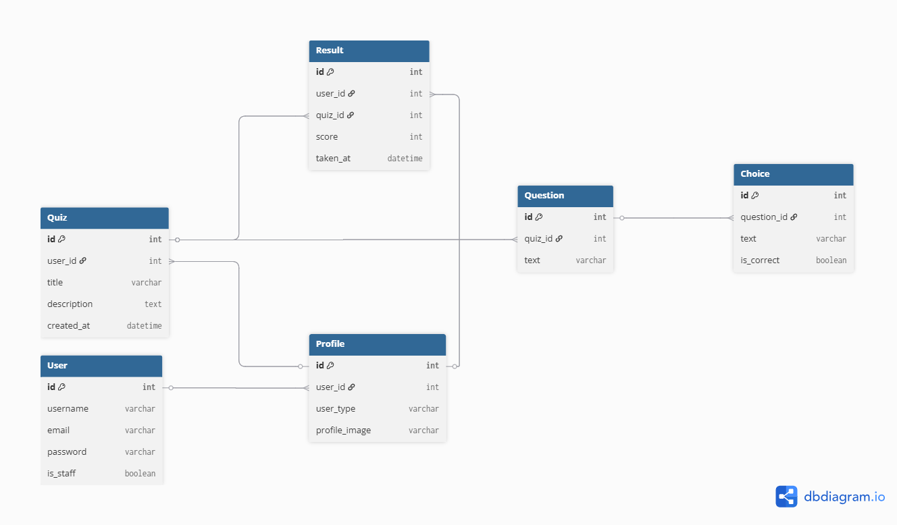

# Capstone-Project
# 🧠 QuizVerse – Online Quiz Creator & Taker Platform

## 💡 Concept
**QuizVerse** is a web platform where any users as teachers can create quizzes and other users as students can take them.  
After completing a quiz, the system automatically grades it and shows the result.  
Quiz creators can view who took their quizzes and their scores, while users can view their own quizzes results.

---

## 👤 User Stories
- As a user, I can register and log in.  
- As a logged-in user, I can create a new quiz (title + questions + choices).  
- As a user, I can view all available quizzes created by others.  
- As a user, I can take a quiz and see my score at the end.  
- As a quiz creator, I can see all participants and their scores for my quizzes.  
- As an admin, I can manage users and quizzes.

---

## ⚙️ Core Features
- ✅ **Authentication** (register, login, logout)  
- ✅ **CRUD for quizzes and questions**  
- ✅ **Logic to record user answers and calculate scores**  
- ✅ **Result tracking for each user**  
- ✅ **Dashboard for quiz creators**  
- ✅ **Dashboard for quiz takers**

## 🛠 Technologies Used

Backend: Django

Frontend: HTML, CSS

Database: SQLite (default Django)

Version Control: Git + GitHub

## 🧩 ERD (Entity Relationship Diagram)

**User (built-in Django)**  
│  
├── **Quiz**  
│   ├── user (FK to User) — *creator* 
│   ├── title (CharField)  
│   ├── description (TextField)  
│   ├── created_at (DateTimeField)  
│  
├── **Question**  
│   ├── quiz (FK to Quiz)  
│   ├── text (CharField)  
│  
├── **Choice**  
│   ├── question (FK to Question)  
│   ├── text (CharField)  
│   ├── is_correct (BooleanField)  
│  
└── **Result**  
    ├── user (FK to User) — *quiz taker*  
    ├── quiz (FK to Quiz)  
    ├── score (IntegerField)  
    ├── taken_at (DateTimeField)  

**Relationships:**  
- Each quiz belongs to a creator (**User**).  
- Each quiz has multiple **Questions**.  
- Each question has multiple **Choices**, with one or more marked as correct.  
- Each **Result** connects a user to a quiz attempt and stores their score.


## 🧱 Database Design (DBML)

- Below is the DBML schema used for the project ERD:

```dbml
Table Profile {
  id int [pk]
  username varchar
  email varchar
  password varchar
  is_staff boolean
}

Table Quiz {
  id int [pk]
  user_id int [ref: > User.id]
  title varchar
  description text
  created_at datetime
}

Table Question {
  id int [pk]
  quiz_id int [ref: > Quiz.id]
  text varchar
}

Table Choice {
  id int [pk]
  question_id int [ref: > Question.id]
  text varchar
  is_correct boolean
}

Table Result {
  id int [pk]
  user_id int [ref: > User.id]
  quiz_id int [ref: > Quiz.id]
  score int
  taken_at datetime
}
```
## ERDimage
-[dbdiagram.io](https://dbdiagram.io/d/68de187ed2b621e422e7e24a)




## 🔢 Feature Breakdown

### 1. Authentication
- Use Django’s built-in user system.  
- Only logged-in users can create or take quizzes.  

### 2. Quiz Creation
- Form to create a quiz (title, description).  
- Add multiple questions and choices to a quiz.  
- Mark correct answer for each question.  
- Quiz creators can edit or delete their own quizzes.  

### 3. Taking a Quiz
- Users choose a quiz from the list.  
- Questions displayed all at once.  
- User submits answers → score calculated automatically.  
- Result stored in the **Result** model.  

### 4. Results for Quiz Takers
- “My Results” page shows:
  - Quiz name  
  - Date taken  
  - Score  

### 5. Results for Quiz Creators
- “My Quizzes” page shows all quizzes the user created.  
- Each quiz displays:
  - List of users who took it  
  - Each user’s score  
  - Date taken  


---

## 🧱 Example Pages

| Page| Description
| **Home (All Quizzes)**| Lists all available quizzes and all taken quizzes (depends on user type)         
| **Quiz Detail**       | Shows description + “Start Quiz” button     
| **Take Quiz**         | Displays questions and choices              
| **Quiz Result**       | Shows score            
| **My Quizzes**        | Lists quizzes created by the logged-in user 
| **My Results**        | Shows all quizzes the user has taken        
| **Add/Edit Quiz**     | Form to create or update a quiz             
| **Login / Register**  | Authentication pages                        


---

## ✨ Stretch Features
- Support multiple correct answers per question  
- Add a timer for quizzes  
- Leaderboard for top scorers per quiz  
- Limit users to retake quizzes  
- Export results as CSV for quiz creators  
- Progress bar during quiz taking  

---
## 🚀 Running the Project / Local Setup

Follow these steps to set up and run the project locally:

1. **Fork** this repository to your GitHub account.  
2. **Clone** your forked repository to your local machine:
   ```bash
   git clone git@github.com:YOUR_USERNAME/capstone.git
Navigate to the project directory:


cd capstone
Create and activate a virtual environment (recommended):


python -m venv venv
source venv/Scripts/activate   # On Windows
source venv/bin/activate       # On macOS/Linux
Install project dependencies:


pip install -r requirements.txt
Apply migrations to set up the database:

python manage.py migrate

Run the development server:

python manage.py runserver
Open your browser and go to:

http://127.0.0.1:8000/

🎉 Now the project should be running locally!

yaml
Copy code

---
---

### 👨‍💻 Author
**Nouran Abo-Jowaid**

---


